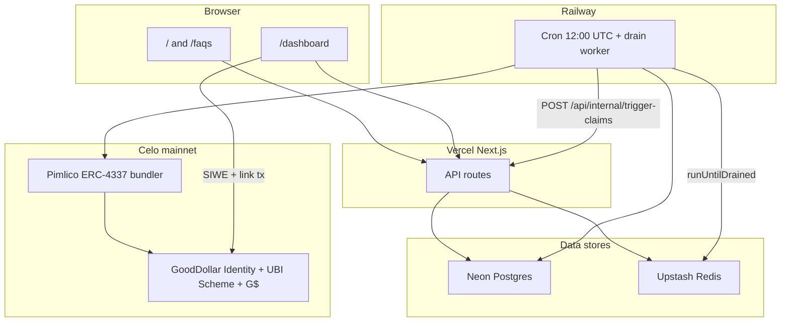
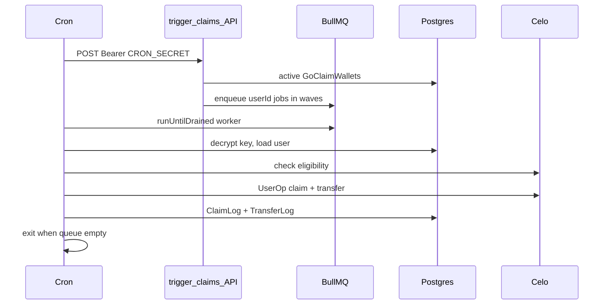

# GoClaim

Your GoodDollar UBI, on autopilot.

GoClaim automatically claims G$ daily on behalf of users who have verified and whitelisted their root wallet on Celo. Users connect via SIWE, GoClaim creates a GoClaim account (ERC-4337), links it once in GoodDollar, and a daily cron enqueues claims through BullMQ at 12:00 PM UTC. G$ is forwarded to the user's root wallet after each claim.

## Architecture at a glance



## Runtime components

| Component | Role | Key files |
|-----------|------|-----------|
| **Next.js app (Vercel)** | Landing, dashboard, FAQs, auth + GoClaim APIs | `app/`, `components/` |
| **Postgres (Neon)** | Users, encrypted GoClaim wallet keys, claim/transfer logs, SIWE nonces | `prisma/schema.prisma` |
| **Redis (Upstash)** | BullMQ claim queue only (not used by dashboard/auth) | `lib/queue.ts` |
| **Cron + drain worker (Railway)** | Daily trigger, process queue, exit | `railway.toml`, `worker/runUntilDrained.ts` |
| **Claim processor** | Runs UBI claim + G$ transfer | `worker/jobs/processClaim.ts` |
| **Pimlico + permissionless** | ERC-4337 UserOps for claim + G$ transfer | `lib/onchain/goClaimAccountClient.ts`, `lib/onchain/claimUbi.ts` |

## User lifecycle

1. **Connect GoodDollar-verified root wallet** — client checks `getWhitelistedRoot` via `lib/hooks/useWalletVerification.ts`; unverified users are sent to GoodDollar face verification.
2. **SIWE sign-in** — JWT session cookie via `app/api/auth/nonce` and `app/api/auth/verify`; server enforces whitelisted root via `lib/requireWhitelistedRoot.ts`.
3. **GoClaim account created** — random EOA + ERC-4337 account (EntryPoint v0.7); GoClaim wallet private key AES-256-GCM encrypted at rest (`lib/onchain/goClaimWallet.ts`, `lib/crypto.ts`).
4. **One-time link** — user signs GoodDollar identity `connect` from their root wallet (`components/ConnectGoClaimButton.tsx`, `lib/onchain/identityConnect.ts`).
5. **Daily claims** — cron enqueues all active GoClaim accounts; worker claims UBI and transfers G$ to root in one UserOp (`lib/onchain/claimUbi.ts`: `UBIScheme.claim` + `G$.transfer`).
6. **Dashboard** — status, claim history, and transfer amounts from `ClaimLog` + `TransferLog` (`app/api/goclaim/status/route.ts`).

## Daily claim pipeline



Jobs are enqueued in waves of 50 with a 2s gap between waves (`lib/queue.ts`). The drain worker uses `WORKER_CONCURRENCY` (default 5), `WORKER_LOCK_DURATION_MS` (default 120s), and exits when the queue is empty — no 24/7 idle polling.

## Database schema

| Model | Purpose |
|-------|---------|
| **User** | Root wallet address; 1:1 with GoClaim wallet |
| **GoClaimWallet** | GoClaim account address, encrypted EOA key, `isActive`, `lastClaimedAt` |
| **ClaimLog** | Per-attempt status (`success` / `skipped` / `failed`), optional tx hash |
| **TransferLog** | 1:1 with successful claim; amount in wei, tx hash, userOp hash |
| **ConnectAccountLog** | One-time GoodDollar `connectAccount` success per user (tx hash, addresses, timestamp) |
| **GoClaimAccountCreatedLog** | On-chain `GoClaimAccountCreated` audit (1 per user) |
| **GoClaimAccountConnectedLog** | On-chain `GoClaimAccountConnected` audit (1 per user) |
| **GoClaimUbiClaimedLog** | On-chain `GoClaimUBIClaimed` per successful claim |
| **GoClaimTokenTransferredLog** | On-chain `GoClaimTokenTransferred` per successful claim |
| **Nonce** | SIWE anti-replay nonces |

See `prisma/schema.prisma` for the full schema.

## API routes

| Route | Auth | Purpose |
|-------|------|---------|
| `GET /api/auth/nonce` | — | Issue SIWE nonce |
| `POST /api/auth/verify` | — | Verify SIWE signature, set session |
| `GET /api/auth/session` | cookie | Current session (`200` + `authenticated: false` when logged out) |
| `POST /api/auth/logout` | cookie | Clear session |
| `POST /api/goclaim/create` | JWT | Create or return GoClaim wallet + account |
| `GET /api/goclaim/status` | JWT | Dashboard state + claim history |
| `POST /api/goclaim/connect-log` | JWT | Log GoodDollar connectAccount tx |
| `POST /api/internal/trigger-claims` | `CRON_SECRET` | Enqueue daily claim jobs |

## On-chain integration

Celo mainnet contracts (`lib/onchain/constants.ts`):

| Contract | Address | Role |
|----------|---------|------|
| Identity proxy | `0xC361A6E67822a0EDc17D899227dd9FC50BD62F42` | Whitelist / link checks |
| UBI Scheme proxy | `0x43d72Ff17701B2DA814620735C39C620Ce0ea4A1` | `claim`, `hasClaimed`, `checkEntitlement` |
| G$ token | `0x62B8B11039FcfE5aB0C56E502b1C372A3d2a9c7A` | Transfer to root after claim |

GoClaim accounts use EntryPoint v0.7 via `permissionless`. UserOps are submitted through Pimlico. Optional `DRPC_API_KEY` improves RPC reliability. Claim, transfer, and root-wallet `connectAccount` calldata include a GOCLAIM attribution suffix (`lib/onchain/attribution.ts`).

## Security model

- **GoClaim wallet private keys** — encrypted with `ENCRYPTION_MASTER_KEY` (AES-256-GCM); only the worker and create API decrypt them.
- **Auth** — HTTP-only JWT cookie; SIWE domain binding; only whitelisted **root** wallets can sign in (linked wallets are rejected).
- **Cron** — `POST /api/internal/trigger-claims` requires `Authorization: Bearer $CRON_SECRET`.
- **Browser** — private keys are never sent to the client after creation.

## Project layout

```
app/           # pages (/, /dashboard, /faqs) + API routes
components/    # UI (ConnectSignIn, dashboard, FAQs)
lib/
  onchain/     # Celo / GoodDollar / ERC-4337
  hooks/       # useSession, useSiweAuth, useWalletVerification
  queue.ts     # BullMQ enqueue + Redis connection
worker/        # claim worker (runUntilDrained + local manual worker)
prisma/        # schema + migrations
scripts/       # claim-test, queue:purge, rotate-keys
```

## Local development

```bash
cp .env.example .env.local
# Fill in DATABASE_URL, JWT_SECRET, ENCRYPTION_MASTER_KEY, etc.

npm install
npx prisma migrate dev
npm run dev
```

Do not run `npm run build` while `npm run dev` is running — it corrupts the `.next` cache. If CSS or chunks 404, stop dev, run `rm -rf .next`, and restart.

For a single-user claim test (preferred over running the worker locally against Upstash):

```bash
USER_ID=<cuid> npm run claim-test
```

To test the full queue locally, enqueue via curl then run `npm run worker:drain`. For a long-running local worker, use `npm run worker`. See [DEPLOY.md](./DEPLOY.md).

## Scripts

| Script | Description |
|--------|-------------|
| `npm run dev` | Next.js dev server |
| `npm run build` | Production build |
| `npm run worker` | Long-running BullMQ worker (local/manual) |
| `npm run worker:drain` | Process queue until empty, then exit |
| `npm run queue:purge` | One-time cleanup of stale Redis job records |
| `npm run claim-test` | Manual claim for one user (`USER_ID=...`) |
| `npm run db:migrate` | Run Prisma migrations |
| `npm run db:generate` | Generate Prisma client |
| `npm run rotate-keys` | Re-encrypt GoClaim wallet keys with a new master key |
| `npm run backfill:goclaim-logs` | Backfill GoClaimAccountCreated/Connected Postgres + on-chain logs |

## Deployment

- **Vercel** — Next.js app (landing, dashboard, APIs).
- **Railway** — daily `0 12 * * *` UTC cron: trigger claims + drain worker (`railway.toml`).
- **Neon** — Postgres.
- **Upstash** — Redis for BullMQ only (no idle polling between daily runs).

Full env var lists, smoke tests, and operational checklists are in [DEPLOY.md](./DEPLOY.md).

## Key rotation

```bash
OLD_MASTER_KEY=... NEW_MASTER_KEY=... npm run rotate-keys
```
